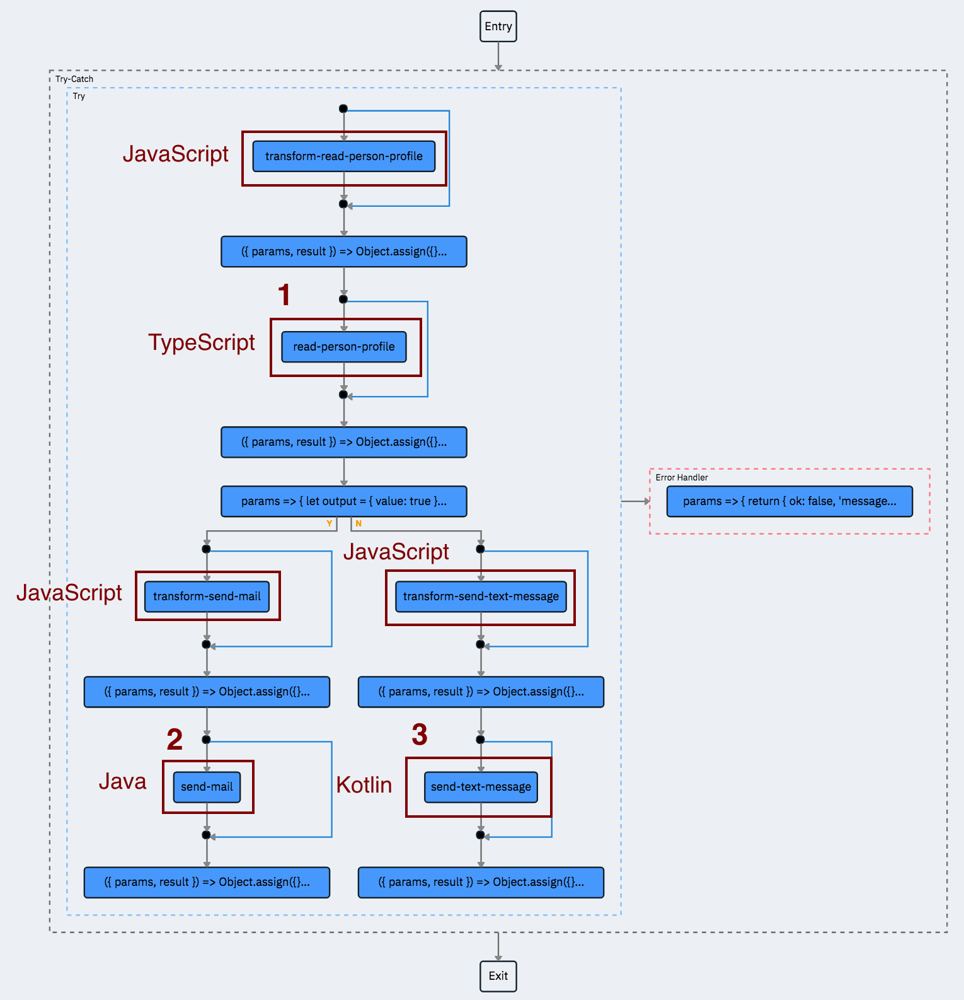
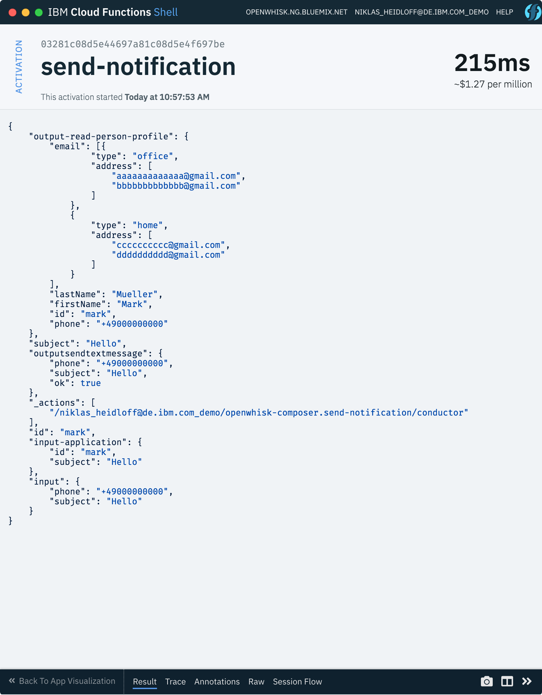

# OpenWhisk Polyglot Application

This project contains samples how to develop functions for [Apache OpenWhisk](https://openwhisk.apache.org/) with JavaScript, TypeScript, Java, Kotlin and Docker. 

While functions are stateless, applications defined with [Composer](https://github.com/ibm-functions/composer) manage the state and are responsible how the data flows between the functions. 

This project contains a sample polyglot application to send either mails or text messages to certain users dependent on which information have provided in their profiles.

Here is the data flow used in this sample to send a notification:

* The application is triggered with a person id and a subject. 
* The function 'read-person-profile' returns the profile for the specific user. The profile contains email addresses and can contain phone numbers.
* If the profile has a phone number, the function 'send-text-message' is invoked, otherwise the funtion 'send-mail'.
* The other functions transfer the data in the format expected by the loosely coupled business logic functions.




### Prerequisites

* [OpenWhisk CLI](https://github.com/apache/incubator-openwhisk-cli)
* [IBM Cloud Account](https://ibm.biz/nheidloff)
* [IBM Cloud CLI](https://clis.ng.bluemix.net/)
* [Composer CLI](https://github.com/ibm-functions/composer/tree/master/docs#installing-the-shell) and Redis
* [Docker](https://docs.docker.com/engine/installation/)
* [git](https://git-scm.com/downloads)

For JavaScript and TypeScript install these additional tools:

* [Visual Studio Code](https://code.visualstudio.com/)
* [Node](https://nodejs.org/en/download/)

For Kotlin install these additional tools:

* [Java JDK](http://www.oracle.com/technetwork/java/javase/downloads/index.html)
* [IntelliJ IDEA Community](https://www.jetbrains.com/idea/download/)
* [Gradle](https://gradle.org/)

For Java install these additional tools:

* [Java JDK](http://www.oracle.com/technetwork/java/javase/downloads/index.html)
* [Eclipse Java EE IDE for Web Developers](https://www.eclipse.org/downloads/packages/eclipse-ide-java-ee-developers/oxygen3rc2)
* [Maven](https://maven.apache.org/install.html)


## Setup

Run these commands to login to IBM Cloud and to create a namespace:

```sh
$ git clone https://github.com/nheidloff/openwhisk-polyglot.git
$ cd openwhisk-polyglot
$ bx login -a api.ng.bluemix.net 
$ bx target --cf
$ wsk package create polyglot-demo-nh
```

Run these commands to build and deploy the JavaScript functions:

```sh
$ wsk action update polyglot-demo-nh/transform-read-person-profile functions/javascript/transform-read-person-profile.js
$ wsk action update polyglot-demo-nh/transform-send-text-message functions/javascript/transform-send-text-message.js
$ cd functions/javascript
$ npm install
$ zip -rq transformsendmail.zip transform-send-mail.js package.json node_modules
$ wsk action update polyglot-demo-nh/transform-send-mail --kind nodejs:8 transformsendmail.zip
$ cd ../..
```

Run these commands to build and deploy the TypeScript function:

```sh
$ cd functions/typescript
$ npm install
$ npm run postinstall
$ docker build -t <dockerhub-name>/openwhisk-docker-typescript-polyglot:latest .
$ docker push <dockerhub-name>/openwhisk-docker-typescript-polyglot
$ bx wsk action update polyglot-demo-nh/read-person-profile --docker <dockerhub-name>/openwhisk-docker-typescript-polyglot:latest
```

Run these commands to build and deploy the Java function:

```sh
$ cd functions/java/spring
$ mvn clean install
$ cd ..
$ docker build -t <dockerhub-name>/openwhisk-docker-spring-boot-polyglot:latest .
$ docker push <dockerhub-name>/openwhisk-docker-spring-boot-polyglot
$ bx wsk action update polyglot-demo-nh/send-mail --docker <dockerhub-name>/openwhisk-docker-spring-boot-polyglot:latest
```

You also need to increase the memory and timeout settings.

Run these commands to build and deploy the Kotlin function:

```sh
$ cd functions/kotlin/kotlin
$ gradle build jar
$ cd ..
$ docker build -t <dockerhub-name>/openwhisk-docker-kotlin-polyglot:latest .
$ docker push <dockerhub-name>/openwhisk-docker-kotlin-polyglot
$ bx wsk action update polyglot-demo-nh/send-text-message --docker <dockerhub-name>/openwhisk-docker-kotlin-polyglot:latest
```

Run this command to create the application:

```sh
$ fsh app update polyglot-demo-nh/send-notification app/app.js
```

To run the application invoke these commands:

```sh
$ fsh app invoke polyglot-demo-nh/send-notification -p id nheidloff -p subject Hello
$ fsh app invoke polyglot-demo-nh/send-notification -p id mark -p subject Hello
```

Here is sample output of the application:




## Run Functions Locally

The JavaScript and TypeScript functions can be run and debugged locally as documented in the project [openwhisk-debug-nodejs](https://github.com/nheidloff/openwhisk-debug-nodejs).

### TypeScript

To run the TypeScript function in a container, open the project in Microsoft Visual Studio Code and run the launch configurations 'typescript function'. After the container has been launched you can invoke the function via this command:

```sh
curl --request POST \
  --url http://localhost:8080/run \
  --header 'Cache-Control: no-cache' \
  --header 'Content-Type: application/json' \
  --data '{ "value": {"id":"nheidloff","subject":"Hello"}}'
```

After you're done stop the container via these commands:

```sh
$ cd functions/typescript
$ docker-compose down
```


### Java

Run these commands to run the Spring Boot function in a Docker container:

```sh
$ cd functions/java/spring
$ mvn clean build
$ cd ..
$ docker build -t openwhisk-docker-spring-boot:latest .
$ docker run -p 8080:8080 --rm=true openwhisk-docker-spring-boot:latest
$ curl --request POST \
  --url http://localhost:8080/run \
  --header 'Cache-Control: no-cache' \
  --header 'Content-Type: application/json' \
  --data '{ "value": {"input":{"email":"aaaaa@gmail.com","subject":"Hello"}}}'
```


### Kotlin

Run these commands to run the Kotlin function in a Docker container:

```sh
$ cd functions/kotlin/kotlin
$ gradle build clean
$ cd ..
$ docker build -t openwhisk-docker-kotlin:latest .
$ docker run -p 8080:8080 --rm=true openwhisk-docker-kotlin:latest
$ curl --request POST \
  --url http://localhost:8080/run \
  --header 'Cache-Control: no-cache' \
  --header 'Content-Type: application/json' \  
  --data '{ "value": {"input":{"phone":"+4900","subject":"Hello"}}}'
```


## More Information

For more information check out these articles on my blog:

* [Debugging Apache OpenWhisk Functions with VS Code](http://heidloff.net/article/debug-apache-openwhisk-functions-vscode)
* [Developing Serverless Functions with TypeScript](http://heidloff.net/article/serverless-functions-typescript-openwhisk)
* [Developing OpenWhisk Functions with Kotlin in IntelliJ](http://heidloff.net/article/openwhisk-kotlin-intellij-docker)
* [Developing OpenWhisk Functions with Spring Boot](http://heidloff.net/article/openwhisk-spring-boot-eclipse)
* [Data Flows in Serverless Cloud-Native Applications](http://heidloff.net/article/serverless-data-flows)
* [Transforming JSON Data in Serverless Applications](http://heidloff.net/article/transforming-json-serverless)